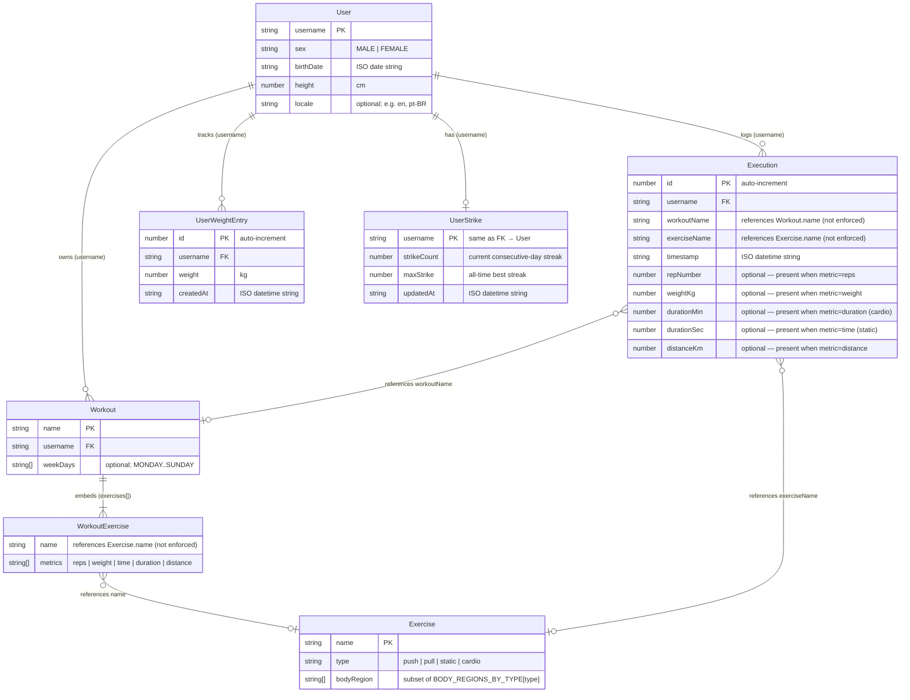

# Database Schema

> **Keep this file in sync with the code.**
> Update it every time you add a migration, rename a field, or change a relationship.
> The source of truth for the schema version is `app/core/infra/config.ts` (`DATABASE_VERSION`).

Current schema version: **10**

---

## Entity Relationship Diagram



---

## Stores reference

| Store | IndexedDB key | Auto-increment | Notes |
|---|---|---|---|
| `users` | `username` | no | Single user per installation |
| `workout` | `name` | no | |
| `exercise` | `name` | no | |
| `execution` | `id` | **yes** | Append-only log |
| `userWeightProgression` | `id` | **yes** | Append-only log |
| `userStrike` | `username` | no | One record per user |

---

## Relationship rules

IndexedDB enforces no foreign keys. Consistency is maintained by the service layer:

- **Renaming an exercise** → `ExerciseService.rename()` cascades to `workout.exercises[].name` and `execution.exerciseName`.
- **Renaming a workout** → `WorkoutService.update()` cascades to `execution.workoutName`.
- **Deleting an exercise or workout** → references in other stores become dangling (no cascade delete by design).

---

## Embedded objects

`Workout.exercises` is stored as a JSON array of `WorkoutExercise` objects directly inside the workout record — it is **not** a separate store.

```ts
interface WorkoutExercise {
  name: string;          // matches Exercise.name
  metrics: ExerciseMetric[];  // subset of METRICS_BY_TYPE[exercise.type]
}
```

Allowed metrics per exercise type (see `METRICS_BY_TYPE` in `app/core/entities/exercise/exercise.ts`):

| Type | Allowed metrics |
|---|---|
| `push` | `reps`, `weight` |
| `pull` | `reps`, `weight` |
| `static` | `time`, `weight` |
| `cardio` | `duration`, `distance` |

---

## Migration history

| Version | File | Change |
|---|---|---|
| 1 | `001-initial_schema.ts` | Create `users`, `workout` (+ legacy `workoutGroup`, `set`) |
| 2 | `002-add_exercise_execution.ts` | Remove legacy stores; add `exercise`, `execution` |
| 3 | `003-add_user_weight_progression.ts` | Add `userWeightProgression` |
| 4 | `004-add_execution_rest.ts` | Add `executionRest` (later removed) |
| 5 | `005-backfill_username.ts` | Backfill `username` field on existing records |
| 6 | `006-add_execution_speed.ts` | Add `executionSpeed` (later removed) |
| 7 | `007-remove_workout_name_from_execution_rest.ts` | Drop `workoutName` from `executionRest` records |
| 8 | `008-remove_execution_rest_and_speed_stores.ts` | Drop `executionRest` and `executionSpeed` stores |
| 9 | `009-add_user_strike.ts` | Add `userStrike` |
| 10 | `010-migrate_workout_exercises.ts` | Migrate `workout.exercises` from `string[]` to `WorkoutExercise[]` |
